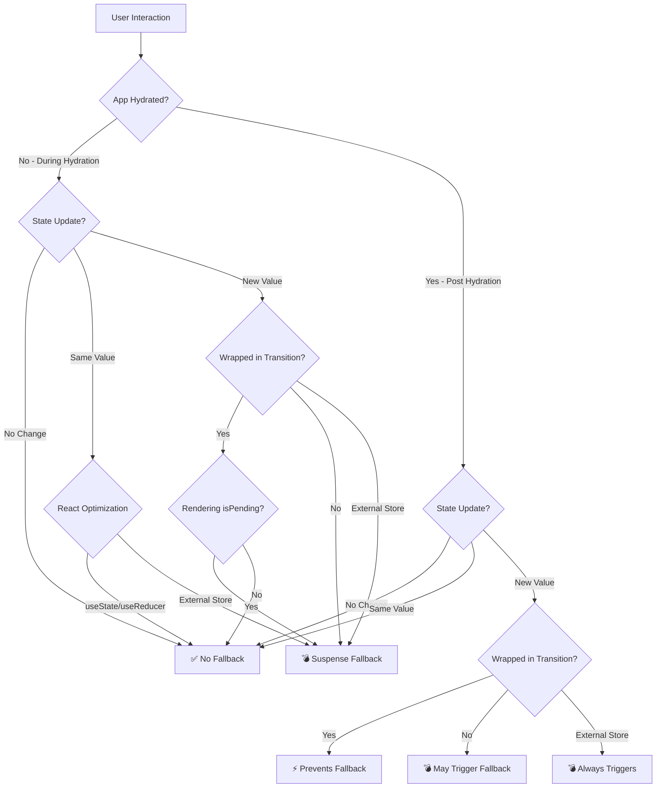

# React Hydration and Suspense: The Complete Behavior Guide

Ever wonder why your perfectly server-rendered content suddenly flashes to a loading spinner when users click something? You're not alone. React's hydration phase has some counterintuitive rules that can catch even experienced developers off guard.

I spent way too much time debugging these behaviors in production, so I built this test suite to document exactly when and why Suspense fallbacks trigger during hydration. Some of the patterns might surprise you.

## 🎯 The Hydration Challenge

When React hydrates server-rendered content, it needs to make components interactive while keeping the UI consistent. React 18 [introduced **selective hydration** and **concurrent rendering**](https://github.com/reactwg/react-18/discussions/37) to improve this process, but there are some tricky parts worth understanding

### Key Insight: Synchronous State Changes Overrule Suspense During Hydration

> [!CAUTION]
> **State updates during hydration always break Suspense** -> your server-rendered content will flash to loading spinners. You can prevent this by wrapping these state changes with `startTransition`



### 💣 What Triggers Suspense Fallbacks

Even if the server includes the full HTML for a **lazy** component, certain patterns during hydration will still trigger Suspense fallbacks and remove the existing content.

**Regular State Updates** ([test](src/tests/SuspenseTriggerOnStateChangeComponent.test.tsx))

```jsx
const [count, setCount] = useState(0);
const handleClick = () => setCount((prev) => prev + 1); // 💣 Triggers fallback
```

**Reducer Updates** ([test](src/tests/SuspenseTriggerOnReducerChangeComponent.test.tsx))

```jsx
const [state, dispatch] = useReducer(reducer, initialState);
const handleClick = () => dispatch({ type: "increment" }); // 💣 Triggers fallback
```

**External Store Changes** ([test](src/tests/SuspenseTriggerOnExternalStoreComponent.test.tsx))

```jsx
const value = useSyncExternalStore(subscribe, getSnapshot);
// Any external store mutation 💣 Always triggers fallback
```

### ✅ What Doesn't Trigger Suspense Fallbacks

React's built-in optimizations prevent fallbacks when updates don't actually change state, and transitions effectively prevent fallbacks during hydration.

**Same-Value State Updates** ([test](src/tests/NoSuspenseOnSameStateValueComponent.test.tsx))

```jsx
const handleClick = () => setCount((prev) => prev); // ✅ React optimizes this away
```

**Same-Value Reducer Updates** ([test](src/tests/NoSuspenseOnSameReducerValueComponent.test.tsx))

```jsx
const reducer = (state, action) => {
  case 'return_same': return state; // ✅ No actual change = no fallback
}
```

**Transition-Wrapped Updates** ([test](src/tests/NoSuspenseTriggerOnTransitionUpdateComponent.test.tsx))

```jsx
const handleClick = () => {
  startTransition(() => {
    setCount((prev) => prev + 1); // ✅ Prevents fallback during hydration
  });
};
```

**useTransition Hook Updates** ([test](src/tests/NoSuspenseTriggerOnUseTransitionUpdateComponent.test.tsx))

```jsx
const [, startTransition] = useTransition();
const handleClick = () => {
  startTransition(() => {
    setCount((prev) => prev + 1); // ✅ Prevents fallback during hydration
  });
};
```

### ⚠️ Transition Edge Case: Rendering isPending

While `startTransition` effectively prevents Suspense fallbacks during hydration, there's one important exception that can catch developers off guard.

**Rendering Transition Pending State** ([test](src/tests/SuspenseTriggerOnIsPendingRenderComponent.test.tsx))

```jsx
const [isPending, startTransition] = useTransition();
const handleClick = () => {
  startTransition(() => {
    setCount((prev) => prev + 1);
  });
};

return (
  <button>
    Counter: {count} {isPending && "(pending)"}{" "}
    {/* 💣 This triggers fallback */}
  </button>
);
```

The state change itself is properly wrapped in a transition, but **rendering the `isPending` state** causes additional renders that aren't transition-wrapped. This can trigger Suspense fallbacks during hydration, making it a subtle but important gotcha for developers who want to display pending states in their UI.

## 💭 Why This Happens

### React's Hydration Priority System

During hydration, React must ensure the client-side component tree matches what was rendered on the server. When state changes occur:

1. **Consistency First**: React re-evaluates the entire component tree
2. **Lazy Components**: If lazy components are still loading, fallbacks must show
3. **No Exceptions**: Even transitions can't override this safety mechanism

### The External Store Exception

External stores using `useSyncExternalStore` have a unique constraint: they **cannot benefit from transition optimizations**. As documented in the React docs, external store mutations cannot be marked as non-blocking transitions, making them always trigger Suspense fallbacks.

### How Transitions Work During Hydration

`startTransition` is effective during **both hydration and post-hydration phases**. During the hydration phase:

- Transitions successfully prevent Suspense fallbacks for state updates
- React can safely defer updates while maintaining consistency
- Both sync and async transitions behave identically and effectively
- The only exception is when rendering `isPending` state, which breaks the optimization

## 📊 Complete Behavior Matrix

| Update Type                            | Behavior                  | Notes                                                                                                                                               |
| -------------------------------------- | ------------------------- | --------------------------------------------------------------------------------------------------------------------------------------------------- |
| `useState` (**new** value)             | 💣 **Triggers fallback**  | Without transition wrapper causes Suspense fallback ([React team guidance](https://github.com/facebook/react/issues/24476#issuecomment-1127800350)) |
| `useState` (**same** value)            | ✅ **Never triggers**     | React's built-in optimization prevents fallback                                                                                                     |
| `useReducer` (**new** value)           | 💣 **Triggers fallback**  | Without transition wrapper causes Suspense fallback ([React team guidance](https://github.com/facebook/react/issues/24476#issuecomment-1127800350)) |
| `useReducer` (**same** value)          | ✅ **Never triggers**     | React's built-in optimization prevents fallback                                                                                                     |
| `startTransition` (sync)               | ✅ **Prevents fallbacks** | Transitions work effectively during hydration and beyond                                                                                            |
| `startTransition` (async)              | ✅ **Prevents fallbacks** | Identical behavior to sync transitions                                                                                                              |
| `startTransition` + `isPending` render | 💣 **Still triggers**     | Rendering isPending state breaks transition optimization                                                                                            |
| `useSyncExternalStore`                 | 💣 **Always triggers**    | Cannot benefit from transitions at any phase ([See docs](https://react.dev/reference/react/useSyncExternalStore#caveats))                           |

## 🚀 Practical Implications

### For User Experience

- **Good**: Fast components don't wait for slow ones
- **Good**: React optimizes away unnecessary updates
- **Good**: Transitions prevent loading flashes during hydration
- **Challenge**: External stores can't benefit from transition optimizations
- **Gotcha**: Rendering `isPending` state can still trigger fallbacks

### For Performance

- **Selective Hydration**: Components hydrate independently
- **Priority-Based**: User interactions can reprioritize hydration
- **Optimization**: Same-value updates are completely skipped
- **Consistent Behavior**: Transitions work the same way throughout the app lifecycle

## 🛠️ Testing Approach

All of this has been thoroughly tested using:

- **Server-Side Rendering**: Real SSR with `renderToPipeableStream`
- **Client Hydration**: Actual hydration with `hydrateRoot`
- **Lazy Components**: Artificial delays to simulate real-world loading
- **Semantic Testing**: Following Testing Library best practices

### Test Structure

```typescript
// 1. Render on server
await renderAndHydrate(<Component />);

// 2. Wait for hydration
await waitFor(() => screen.getByRole("button"));

// 3. Trigger state change
fireEvent.click(screen.getByRole("button"));

// 4. Verify Suspense behavior
expect(screen.findByText("Suspended")).resolves.toBeInTheDocument();
```

## 🔑 Key Takeaways

1. **Transitions effectively prevent Suspense fallbacks during hydration** - `startTransition` works as intended in both phases
2. **The isPending edge case** - rendering `isPending` state can still trigger fallbacks even within transitions
3. **External stores have inherent limitations** - they cannot benefit from transition optimizations at any phase
4. **React optimizes same-value updates** - built-in optimization prevents unnecessary fallbacks
5. **Transitions work consistently** - same behavior and effectiveness during hydration and post-hydration phases

## 🧪 Try It Yourself

[](https://github.com/jantimon/react-hydration-rules/actions/workflows/test.yml)

Don't trust my word? Good - you shouldn't. Every behavior I've documented here comes from actual tests you can run yourself.

Just clone this repo and run `npm test` to see all these hydration quirks in action. The tests use real SSR with `renderToPipeableStream` and actual hydration with `hydrateRoot` - no mocks or shortcuts.

I wrote these tests because I was debugging some gnarly hydration issues in production and couldn't find clear documentation anywhere. Turns out React's hydration behavior has some pretty specific rules that aren't obvious until you hit them.

---

## 🙏 Thanks

Big thanks to [@rickhanlonii](https://github.com/rickhanlonii) and [@gaearon](https://github.com/gaearon) for catching an important mistake in my original understanding
