```mermaid
flowchart TD
    A[User Interaction] --> B{App Hydrated?}

    B -->|No - During Hydration| C{State Update?}
    B -->|Yes - Post Hydration| D{State Update?}

    C -->|No Change| E[✅ No Fallback]
    C -->|Same Value| F{React Optimization}
    C -->|New Value| G{External Store?}

    F -->|useState/useReducer| E
    F -->|External Store| H[💣 Suspense Fallback]

    G -->|Yes - useSyncExternalStore| H[💣 Always Triggers]
    G -->|No| I{Wrapped in Transition?}

    I -->|No| H[💣 Suspense Fallback]
    I -->|Yes| J{Async Operation?}

    J -->|No - Sync| K{Rendering isPending?}
    J -->|Yes - Async| L{When is State Update?}

    K -->|Yes| H[💣 Suspense Fallback]
    K -->|No| E[✅ No Fallback]

    L -->|Pre-await| E[✅ No Fallback]
    L -->|Post-await| M{Correctly Wrapped?}

    M -->|No - Lost Context| H[💣 Suspense Fallback]
    M -->|Yes| N{Which startTransition?}

    N -->|Direct Import| O{Rendering isPending?}
    N -->|useTransition Hook| H[💣 Still Triggers]

    O -->|Yes| H[💣 Suspense Fallback]
    O -->|No| E[✅ No Fallback]

    D -->|No Change| E
    D -->|Same Value| E
    D -->|New Value| P{External Store?}

    P -->|Yes| Q[💣 Always Triggers]
    P -->|No| R{Wrapped in Transition?}

    R -->|Yes| S[⚡ Prevents Fallback]
    R -->|No| T[💣 May Trigger Fallback]
```

# React Hydration and Suspense: The Complete Behavior Guide

Ever wonder why your perfectly server-rendered content suddenly flashes to a loading spinner when users click something? You're not alone. React's hydration phase has some counterintuitive rules that can catch even experienced developers off guard.

I spent way too much time debugging these behaviors in production, so I built this test suite to document exactly when and why Suspense fallbacks trigger during hydration. Some of the patterns might surprise you.

## 🎯 The Hydration Challenge

When React hydrates server-rendered content, it needs to make components interactive while keeping the UI consistent. React 18 [introduced **selective hydration** and **concurrent rendering**](https://github.com/reactwg/react-18/discussions/37) to improve this process, but there are some tricky parts worth understanding

### Key Insight: Synchronous State Changes Overrule Suspense During Hydration

> [!CAUTION]
> **State updates during hydration always break Suspense** -> your server-rendered content will flash to loading spinners. You can prevent this by wrapping these state changes with `startTransition`



### 💣 What Triggers Suspense Fallbacks

Even if the server includes the full HTML for a **lazy** component, certain patterns during hydration will still trigger Suspense fallbacks and remove the existing content.

**Regular State Updates** ([test](src/tests/SuspenseTriggerOnStateChangeComponent.test.tsx))

```jsx
const [count, setCount] = useState(0);
const handleClick = () => setCount((prev) => prev + 1); // 💣 Triggers fallback
```

**Reducer Updates** ([test](src/tests/SuspenseTriggerOnReducerChangeComponent.test.tsx))

```jsx
const [state, dispatch] = useReducer(reducer, initialState);
const handleClick = () => dispatch({ type: "increment" }); // 💣 Triggers fallback
```

**External Store Changes** ([test](src/tests/SuspenseTriggerOnExternalStoreComponent.test.tsx))

```jsx
const value = useSyncExternalStore(subscribe, getSnapshot);
// Any external store mutation 💣 Always triggers fallback
```

**Async State Updates After await** ([test](src/tests/SuspenseTriggerOnAsyncStateAfterAwaitComponent.test.tsx))

```jsx
const handleClick = () => {
  startTransition(async () => {
    await someAsyncOperation();
    setCount((prev) => prev + 1); // 💣 Loses transition context after await
  });
};
```

**Correctly Wrapped Async useTransition** ([test](src/tests/SuspenseTriggerOnCorrectlyWrappedAsyncUseTransitionComponent.test.tsx))

```jsx
const [, startTransition] = useTransition();
const handleClick = () => {
  startTransition(async () => {
    await someAsyncOperation();
    startTransition(() => {
      setCount((prev) => prev + 1); // 💣 Still triggers fallback during hydration with useTransition
    });
  });
};
```

**Deferred Value Updates** ([test](src/tests/SuspenseTriggerOnDeferredValueComponent.test.tsx))

```jsx
const [count, setCount] = useState(0);
const deferredCount = useDeferredValue(count);
const handleClick = () => setCount((prev) => prev + 1); // 💣 Triggers fallback even when rendering deferred value
return <p onClick={handleClick}>Counter: {deferredCount}</p>;
```

### ✅ What Doesn't Trigger Suspense Fallbacks

React's built-in optimizations prevent fallbacks when updates don't actually change state, and transitions effectively prevent fallbacks during hydration.

**Same-Value State Updates** ([test](src/tests/NoSuspenseOnSameStateValueComponent.test.tsx))

```jsx
const handleClick = () => setCount((prev) => prev); // ✅ React optimizes this away
```

**Same-Value Reducer Updates** ([test](src/tests/NoSuspenseOnSameReducerValueComponent.test.tsx))

```jsx
const reducer = (state, action) => {
  case 'return_same': return state; // ✅ No actual change = no fallback
}
```

**Transition-Wrapped Updates** ([test](src/tests/NoSuspenseTriggerOnTransitionUpdateComponent.test.tsx))

```jsx
const handleClick = () => {
  startTransition(() => {
    setCount((prev) => prev + 1); // ✅ Prevents fallback during hydration
  });
};
```

**useTransition Hook Updates** ([test](src/tests/NoSuspenseTriggerOnUseTransitionUpdateComponent.test.tsx))

```jsx
const [, startTransition] = useTransition();
const handleClick = () => {
  startTransition(() => {
    setCount((prev) => prev + 1); // ✅ Prevents fallback during hydration
  });
};
```

**Correctly Wrapped Async startTransition (Direct Import)** ([test](src/tests/NoSuspenseTriggerOnCorrectlyWrappedAsyncTransitionComponent.test.tsx))

```jsx
import { startTransition } from "react";

const handleClick = () => {
  startTransition(async () => {
    await someAsyncOperation();
    startTransition(() => {
      setCount((prev) => prev + 1); // ✅ Prevents fallback during hydration
    });
  });
};
```

### ⚠️ Transition Edge Cases

While `startTransition` effectively prevents Suspense fallbacks during hydration, there are important exceptions that can catch developers off guard.

#### React's Async Context Limitation

Due to a JavaScript limitation, React loses the transition context after `await` operations. As documented in the [React docs](https://react.dev/reference/react/useTransition#react-doesnt-treat-my-state-update-after-await-as-a-transition), state updates after `await` are not automatically treated as transitions and will trigger Suspense fallbacks during hydration.

The React docs recommend wrapping post-`await` state updates in another `startTransition`, but the effectiveness depends on which `startTransition` you use:

```jsx
// ❌ Loses transition context after await
startTransition(async () => {
  await someAsyncFunction();
  setCount(1); // Triggers fallback during hydration
});

// ✅ Correctly wrapped with direct import - prevents fallback during hydration
import { startTransition } from "react";
startTransition(async () => {
  await someAsyncFunction();
  startTransition(() => {
    setCount(1); // Prevents fallback during hydration
  });
});

// 💣 Correctly wrapped with useTransition - still triggers fallback during hydration
const [, startTransition] = useTransition();
startTransition(async () => {
  await someAsyncFunction();
  startTransition(() => {
    setCount(1); // Still triggers fallback during hydration
  });
});
```

The nested `startTransition` pattern works during hydration only when using the direct import from React, not when using the `startTransition` from the `useTransition()` hook.

#### Rendering isPending State

Even when state changes are properly wrapped in transitions, rendering the `isPending` state can still trigger fallbacks during hydration.

**Rendering Transition Pending State** ([test](src/tests/SuspenseTriggerOnIsPendingRenderComponent.test.tsx))

```jsx
const [isPending, startTransition] = useTransition();
const handleClick = () => {
  startTransition(() => {
    setCount((prev) => prev + 1);
  });
};

return (
  <button>
    Counter: {count} {isPending && "(pending)"}{" "}
    {/* 💣 This triggers fallback */}
  </button>
);
```

The state change itself is properly wrapped in a transition, but **rendering the `isPending` state** causes additional renders that aren't transition-wrapped. This can trigger Suspense fallbacks during hydration, making it a subtle but important gotcha for developers who want to display pending states in their UI.

## 💭 Why This Happens

### The External Store Exception

External stores using `useSyncExternalStore` have a unique constraint: they **cannot benefit from transition optimizations**. As documented in the React docs, external store mutations cannot be marked as non-blocking transitions, making them always trigger Suspense fallbacks.

### The Async Context Limitation

React loses the transition context after `await` operations due to a JavaScript limitation. This means state updates after `await` behave like synchronous updates and will trigger Suspense fallbacks during hydration, even when the initial call was wrapped in `startTransition`.

This limitation will be resolved once [AsyncContext](https://github.com/tc39/proposal-async-context) becomes available, but for now the workaround is to wrap post-`await` state updates in another `startTransition`.

### How Transitions Work During Hydration

`startTransition` is effective during **both hydration and post-hydration phases**. During the hydration phase:

- Transitions successfully prevent Suspense fallbacks for synchronous state updates
- React can safely defer updates while maintaining consistency
- The exceptions are async state updates after `await` and rendering `isPending` state, which break the optimization

## 📊 Complete Behavior Matrix

| Update Type                                                 | Behavior                                                                                                    | Notes                                                                                                                                                                         |
| ----------------------------------------------------------- | ----------------------------------------------------------------------------------------------------------- | ----------------------------------------------------------------------------------------------------------------------------------------------------------------------------- |
| `useState` (**new** value)                                  | 💣 **[Triggers fallback](src/tests/SuspenseTriggerOnStateChangeComponent.test.tsx)**                        | Without transition wrapper causes Suspense fallback ([React team guidance](https://github.com/facebook/react/issues/24476#issuecomment-1127800350))                           |
| `useState` (**same** value)                                 | ✅ **[Never triggers](src/tests/NoSuspenseOnSameStateValueComponent.test.tsx)**                             | React's built-in optimization prevents fallback                                                                                                                               |
| `useReducer` (**new** value)                                | 💣 **[Triggers fallback](src/tests/SuspenseTriggerOnReducerChangeComponent.test.tsx)**                      | Without transition wrapper causes Suspense fallback ([React team guidance](https://github.com/facebook/react/issues/24476#issuecomment-1127800350))                           |
| `useReducer` (**same** value)                               | ✅ **[Never triggers](src/tests/NoSuspenseOnSameReducerValueComponent.test.tsx)**                           | React's built-in optimization prevents fallback                                                                                                                               |
| `startTransition` (sync)                                    | ✅ **[Prevents fallbacks](src/tests/NoSuspenseTriggerOnTransitionUpdateComponent.test.tsx)**                | Transitions work effectively during hydration and beyond                                                                                                                      |
| `startTransition` (async - pre-await)                       | ✅ **[Prevents fallbacks](src/tests/NoSuspenseTriggerOnUseTransitionUpdateComponent.test.tsx)**             | State updates before await maintain transition context                                                                                                                        |
| `startTransition` (async - post-await)                      | 💣 **[Triggers fallback](src/tests/SuspenseTriggerOnAsyncStateAfterAwaitComponent.test.tsx)**               | React loses transition context after await ([See React docs](https://react.dev/reference/react/useTransition#react-doesnt-treat-my-state-update-after-await-as-a-transition)) |
| `startTransition` (correctly wrapped async - direct import) | ✅ **[Prevents fallbacks](src/tests/NoSuspenseTriggerOnCorrectlyWrappedAsyncTransitionComponent.test.tsx)** | Nested startTransition from direct import preserves context during hydration                                                                                                  |
| `startTransition` (correctly wrapped async - useTransition) | 💣 **[Still triggers](src/tests/SuspenseTriggerOnCorrectlyWrappedAsyncUseTransitionComponent.test.tsx)**    | Nested startTransition from useTransition hook still triggers fallbacks during hydration                                                                                      |
| `startTransition` + `isPending` render                      | 💣 **[Still triggers](src/tests/SuspenseTriggerOnIsPendingRenderComponent.test.tsx)**                       | Rendering isPending state breaks transition optimization                                                                                                                      |
| `useDeferredValue`                                          | 💣 **[Triggers fallback](src/tests/SuspenseTriggerOnDeferredValueComponent.test.tsx)**                      | Deferred values don't prevent fallbacks during hydration - state change still triggers Suspense                                                                               |
| `useSyncExternalStore`                                      | 💣 **[Always triggers](src/tests/SuspenseTriggerOnExternalStoreComponent.test.tsx)**                        | Cannot benefit from transitions at any phase ([See docs](https://react.dev/reference/react/useSyncExternalStore#caveats))                                                     |

## 🚀 Practical Implications

### For User Experience

- **Good**: Fast components don't wait for slow ones
- **Good**: React optimizes away unnecessary updates
- **Good**: Transitions prevent loading flashes during hydration
- **Challenge**: External stores can't benefit from transition optimizations
- **Gotcha**: Rendering `isPending` state can still trigger fallbacks

### For Performance

- **Selective Hydration**: Components hydrate independently
- **Priority-Based**: User interactions can reprioritize hydration
- **Optimization**: Same-value updates are completely skipped
- **Consistent Behavior**: Transitions work the same way throughout the app lifecycle

## 🛠️ Testing Approach

All of this has been thoroughly tested using:

- **Server-Side Rendering**: Real SSR with `renderToPipeableStream`
- **Client Hydration**: Actual hydration with `hydrateRoot`
- **Lazy Components**: Artificial delays to simulate real-world loading
- **Semantic Testing**: Following Testing Library best practices

### Test Structure

```typescript
// 1. Render on server
await renderAndHydrate(<Component />);

// 2. Wait for hydration
await waitFor(() => screen.getByRole("button"));

// 3. Trigger state change
fireEvent.click(screen.getByRole("button"));

// 4. Verify Suspense behavior
expect(screen.findByText("Suspended")).resolves.toBeInTheDocument();
```

## 🔑 Key Takeaways

1. **Transitions effectively prevent Suspense fallbacks during hydration** - `startTransition` works as intended for synchronous updates
2. **The async context limitation** - React loses transition context after `await`, requiring nested `startTransition` calls
3. **The isPending edge case** - rendering `isPending` state can still trigger fallbacks even within transitions
4. **External stores have inherent limitations** - they cannot benefit from transition optimizations at any phase
5. **React optimizes same-value updates** - built-in optimization prevents unnecessary fallbacks

## 🧪 Try It Yourself

[](https://github.com/jantimon/react-hydration-rules/actions/workflows/test.yml)

Don't trust my word? Good - you shouldn't. Every behavior I've documented here comes from actual tests you can run yourself.

Just clone this repo and run `npm test` to see all these hydration quirks in action. The tests use real SSR with `renderToPipeableStream` and actual hydration with `hydrateRoot` - no mocks or shortcuts.

I wrote these tests because I was debugging some gnarly hydration issues in production and couldn't find clear documentation anywhere. Turns out React's hydration behavior has some pretty specific rules that aren't obvious until you hit them.

---

## 🙏 Thanks

Big thanks to [@rickhanlonii](https://github.com/rickhanlonii) and [@gaearon](https://github.com/gaearon) for catching an important mistake in my original understanding
